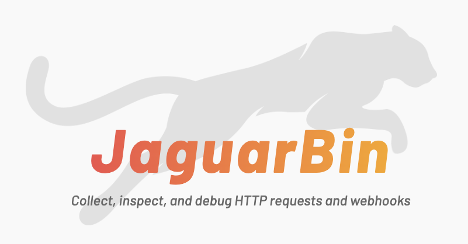
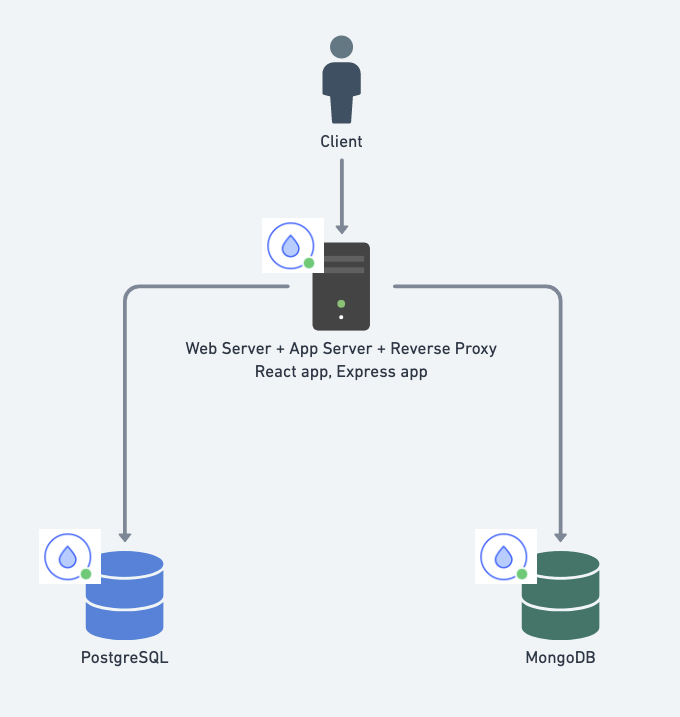

# JaguarBin

[JaguarBin](https://jaguarbin.teamjaguar.org/) is a tool for collecting and inspecting HTTP requests and webhooks. Webhooks are messages sent by apps when an event occurs. They are less resource intensive than polling. JaguarBin enables you to create bins for storing requests and viewing their details. It generates a URL you can give to webhook providers.

Built with: Express, React, Tailwind, MongoDB, Postgres, Nginx, DigitalOcean Droplets.

JaguarBin supports multiple bins to organize your webhooks.

Within each bin you can inspect and analyze the Header and Payload.

